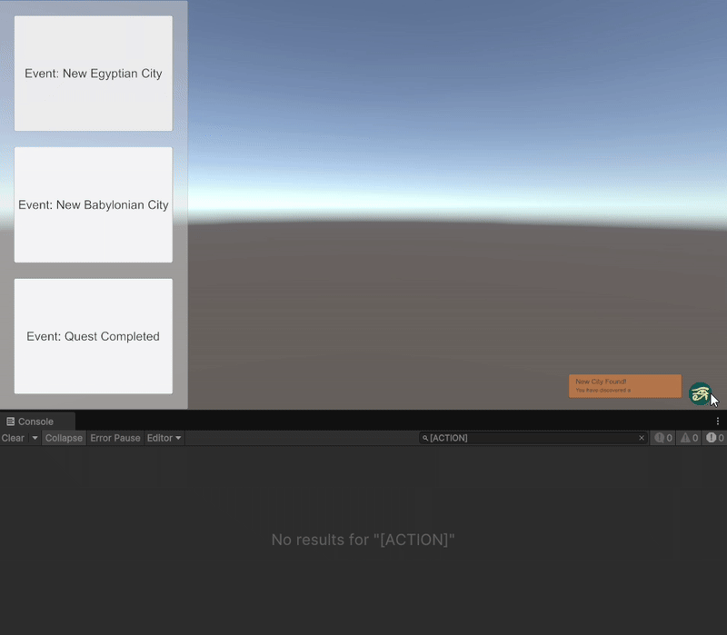

# OMGG Chronicle

    

  
  
  
  

  
  

  
  

---

## Demo Overview

The **OMGG Chronicle** demo illustrates how the package can be used to track game events and trigger associated actions (e.g., map focus, popups...) in a Unity project.

In the demo:
- Click buttons like *“New Egyptian City”* or *“Quest Completed”* to generate Chronicle entries.
- Each entry can include an **action callback** and a **payload** (extra data).
- Entries are displayed in a UI list with interactive tooltips.
- The demo simulates server-authoritative behavior locally to keep network paradigms consistent.

> For a detailed walkthrough of the demo setup and usage, check the [Chronicle Demo Wiki page](https://github.com/omgg-dev/Chronicle/wiki/Demo).

---

## ⚠️ License Notice

This repository is **not open source**.

- The source code is proprietary and may not be used, copied, or modified without prior permission.
- All assets (visuals, sounds, etc.) are licensed **exclusively to OMGG** and may not be reused or redistributed.

For any inquiries or collaboration proposals, feel free to contact us.
